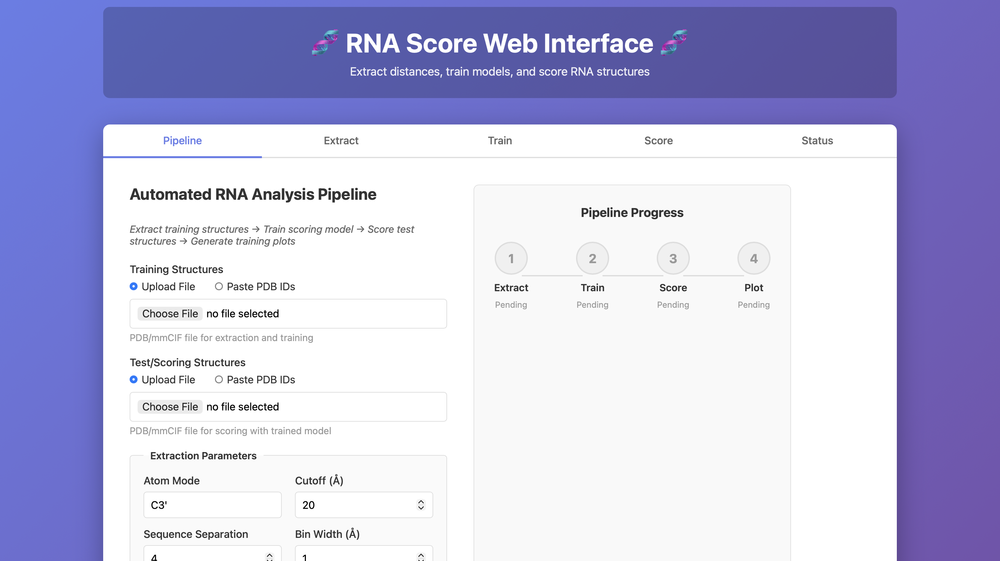
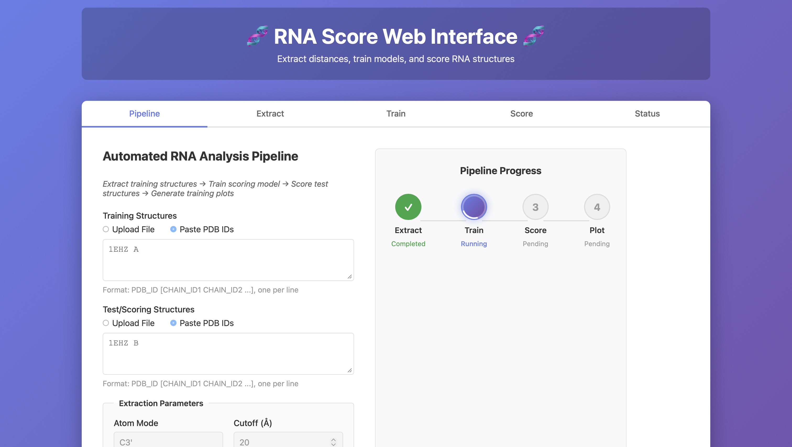
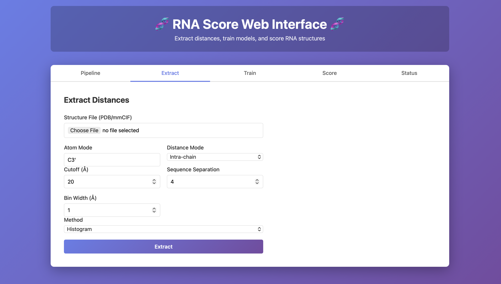
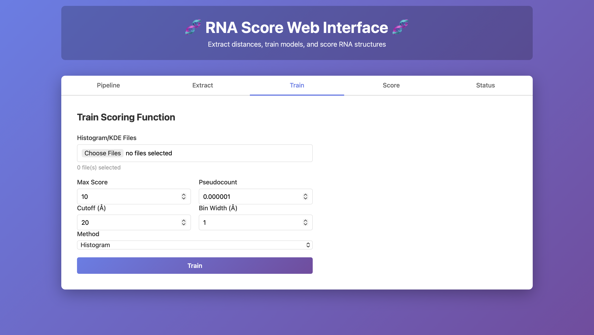
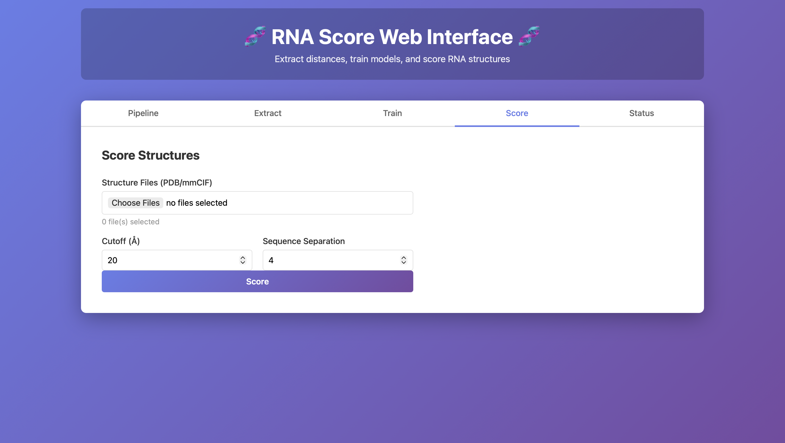
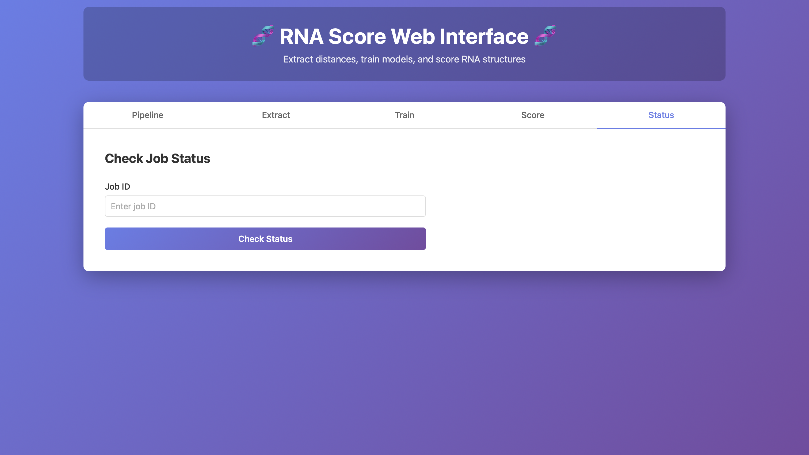

# Web Tool (Hosted Interface)

This web interface is the easiest way to run the RNA Score workflow without installing anything locally. It provides two ways to operate:

- **Pipeline tab**: run the full workflow end-to-end in one go (recommended).
- **Extract / Train / Score tabs**: run each stage manually if you want to reuse intermediate files or debug a specific step.
- **Status tab**: recover progress and outputs using a Job ID (useful for long jobs or after refreshing the page).

> This page focuses on how to operate the website (inputs, parameters, outputs, and troubleshooting). The scientific rationale is described in the Background section.

---

## Quick start (recommended)

1. Go to **Pipeline**.
2. Provide **Training Structures** (native/reference set).
3. Provide **Test/Scoring Structures** (structures you want to evaluate).
4. Leave defaults (or adjust cutoff/atom/separation if you know why).
5. Click **Run Pipeline**.
6. Download outputs from the **results page** (scores + full artifact bundle).

---

## Pipeline tab (end-to-end workflow)

The Pipeline tab runs:

1) **Extract** distances from the training set  
2) **Train** a model from those distances  
3) **Score** the test structures  
4) (Optional) **Plot** summaries

### Inputs: training vs test structures

You must provide two structure lists:

#### Training Structures
Used only to learn distributions / build the scoring model.

#### Test / Scoring Structures
Evaluated with the trained model.

Each input supports:
- **Upload File** (PDB/mmCIF file(s))
- **Paste PDB IDs** (one per line, optionally with chain IDs)

**Paste format**
- `PDB_ID`
- `PDB_ID CHAIN`
- `PDB_ID CHAIN1 CHAIN2 ...`

Example:
- `1EHZ A`
- `1EHZ B`

---

### Parameters (what they control)

These settings affect both runtime and what gets measured.

- **Atom mode**: nucleotide representative atom (e.g., `C3'`).  
  If a structure lacks that atom (missing residues/atoms), fewer contacts will be extracted.
- **Cutoff (Å)**: maximum distance retained.  
  Larger cutoff → more pairs → slower extraction/scoring and larger outputs.
- **Sequence separation**: minimum |i−j| along the sequence to keep.  
  Larger separation → fewer local neighbors → faster runs and fewer trivial contacts.
- **Bin width (Å)**: discretization resolution.  
  Smaller bin width → finer bins → potentially noisier tables unless you have lots of data.

Keep parameters consistent across runs if you want scores to be comparable.

---

### Progress tracker and what to expect

The progress card shows the current stage:

- **Extract**: parses structures, extracts distance pairs, writes extracted artifacts.
- **Train**: generates frequency and score tables from extracted artifacts.
- **Score**: evaluates test structures and produces `scores.csv`.
- **Plot**: produces optional plots (if enabled in your deployment).

If you refresh the page mid-run, recover the job using the **Status** tab (see below).

---

### Results and downloads

> **Insert screenshot:** Results table + Download link  
> **Insert screenshot:** All Output Files panel

Once complete, you can download:

- **Detailed scores** (`scores.csv`): final outputs for the test set.
- **All Output Files**: the full reproducible bundle (training tables, metadata, extracted files, plots if any).

A typical bundle includes:
- `training_output/freq_*.csv`
- `training_output/score_*.csv`
- `training_output/metadata.json`
- extracted distributions under `extracted/`
- `scores.csv` for the scored structures

---

## Extract tab (manual step 1)

Use this tab when you want to generate extraction artifacts once and reuse them.

### How to use
1. Upload a **Structure File (PDB/mmCIF)**.
2. Set:
   - **Atom Mode**
   - **Distance Mode** (e.g., intra-chain)
   - **Cutoff (Å)**
   - **Sequence Separation**
   - **Bin Width (Å)**
   - **Method** (usually Histogram)
3. Click **Extract**.

### Output
This produces the histogram/KDE-like files that you later select in the **Train** tab.

### Operational notes
- If extraction outputs are unexpectedly small or empty, the most common causes are missing atoms/residues, wrong chain selection, or overly strict cutoff/separation.
- Increasing cutoff increases runtime quickly (number of pairs grows fast).

---

## Train tab (manual step 2)

Use this tab when you already have extracted histogram/KDE files and want to generate the scoring tables.

### How to use
1. Select **Histogram/KDE Files** (from a previous Extract or Pipeline run).
2. Configure:
   - **Max Score**: clamps extreme values; helps stability.
   - **Pseudocount**: prevents zeros; helps avoid undefined values.
   - **Cutoff (Å)**, **Bin Width (Å)**: must match the extracted file bins.
   - **Method**: Histogram (or KDE if supported).
3. Click **Train**.

### Output
- `freq_*.csv` frequency tables  
- `score_*.csv` scoring tables  
- `metadata.json` with the training settings

### Operational notes
- A mismatch between extraction bin width/cutoff and training settings is a common source of “weird” or inconsistent scores later.
- If you change parameters, treat the resulting model as a different model (do not compare scores across different parameter sets).

---

## Score tab (manual step 3)

Use this tab when you already trained a model and want to score additional structures.

### How to use
1. Upload **Structure Files (PDB/mmCIF)**.
2. Set **Cutoff (Å)** and **Sequence Separation** (should match the model assumptions).
3. Click **Score**.

### Output
The scoring step produces a `scores.csv` (and often per-contact breakdown tables) that can be downloaded from the results view.

### Operational notes
- Scores are only comparable when produced using the same trained model (same extraction/training parameters and training set).
- If scoring is slow, reduce cutoff or increase sequence separation.

---

## Status tab (monitoring, recovery, debugging)

The interface runs jobs asynchronously. The Status tab allows you to query a run after navigation or refresh.

### How to use
1. Paste the **Job ID** you received when starting a run.
2. Click **Check Status**.

### What to use it for
- Recover progress if the page reloads.
- Retrieve error messages if a run fails.
- Confirm completion before downloading outputs.